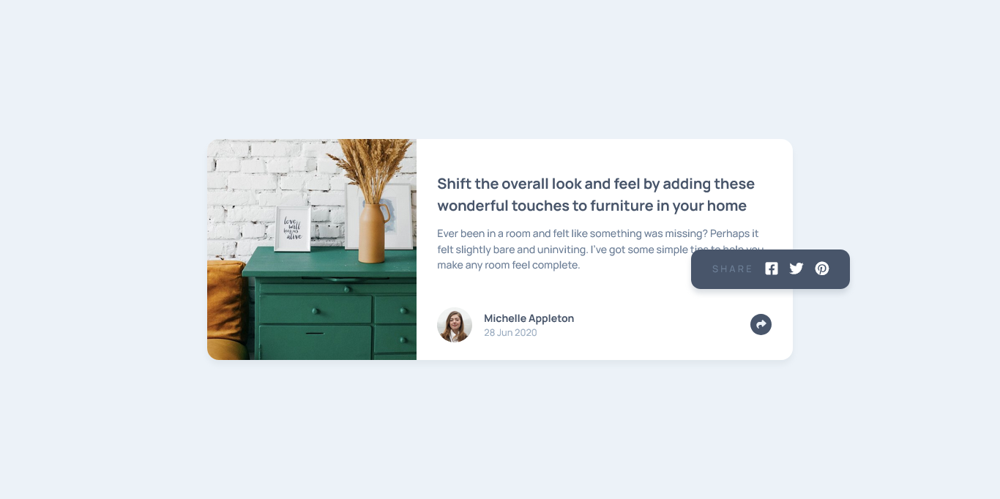

# Frontend Mentor - Article preview component solution

This is a solution to the [Article preview component challenge on Frontend Mentor](https://www.frontendmentor.io/challenges/article-preview-component-dYBN_pYFT). Frontend Mentor challenges help you improve your coding skills by building realistic projects. 

## Table of contents

- [Overview](#overview)
  - [The challenge](#the-challenge)
  - [Screenshot](#screenshot)
  - [Links](#links)
- [My process](#my-process)
  - [Built with](#built-with)
  - [What I learned](#what-i-learned)
  - [Continued development](#continued-development)
  - [Useful resources](#useful-resources)
- [Author](#author)
- [Acknowledgments](#acknowledgments)


## Overview

### The challenge

Users should be able to:

- View the optimal layout for the component depending on their device's screen size
- See the social media share links when they click the share icon

### Screenshot

Note: As you can see, it's not close to the initial design. 




### Links

- Solution URL: [Github](https://github.com/loifloro/article-preview-component)
- Live Site URL: [Github Pages](https://loifloro.github.io/article-preview-component/dist/)

## My process

### Built with

- Semantic HTML5 markup
- CSS custom properties
- Flexbox
- CSS Grid
- Mobile-first workflow
- Sass
- Normalize.css
- Font Awesome
- Javascript

### What I learned

In this project I had a quite difficult time to create the tooltip. It is also my first time to use the content-visibiliy on my project. I also implemented the usage of rem to replace some of the pixel measurements as I get from my previous feedbacks here on Frontend Mentor. 

```css
body {
    content-visibility: auto;

}
a:focus-visible {
    outline: $grayish-blue solid 1px;
}
@media (min-width: 47.5rem) {
    object-position: left;

}
```

### Continued development

On my future projects, Im going to:

- Get better on styling different components
- Practice Javascript DOM
- Use the rem instead of percents
- Practice the accessibililty on the web
- Implement the usage of fluid typography

### Useful resources

- [Fluid Typography Calculator](https://royalfig.github.io/fluid-typography-calculator/) - This is a helpful way to manage the clamp function for the font sizes. 

## Author
- Github - [loifloro](https://github.com/loifloro/)
- Frontend Mentor - [@loifloro](https://www.frontendmentor.io/profile/loifloro)
- Twitter - [@loisfloro](https://www.twitter.com/yourusername)

## Acknowledgments
Thank you Frontend Mentor for having projects that helps beginner to really enhance their knowledge.
